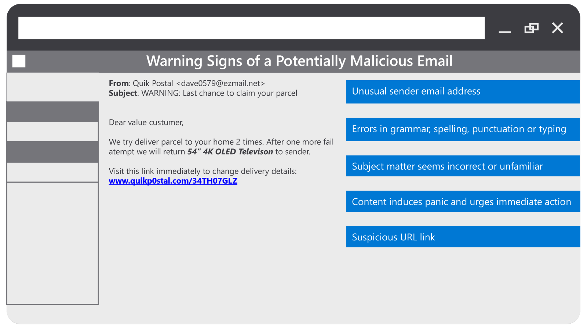
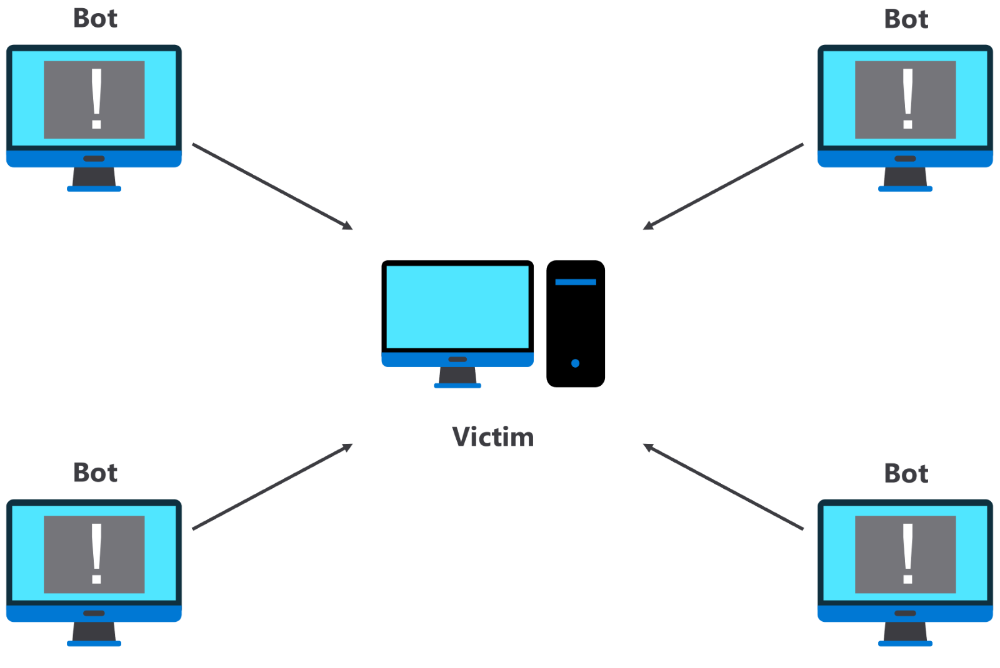

# Threat Stats

## Introduction

Previously, you gained some insight into what a threat landscape is. You should now be familiar with the possible entry points into a system, the approaches used by potential attackers, and the tools they use in an attack.

In this reading, you’ll analyze some real-life examples to better understand the most prevalent types of attacks and how they are propagated, as well as tips for safeguarding against them.

## Breaking Down Modern Cybercrime

For an example of an organization that faces constant threats, let’s examine Cisco’s Umbrella Cloud Architecture defense, which is a global cloud defense system that deals with billions of online transactions daily. An analysis of their usage in November of 2021 provides a snapshot of the type of crime that is currently being engaged with. Below you’ll find a chart that breaks down the types of attacks across one month.

You'll notice that a prominent attack type highlighted in this chart is adware, which is a type of software that frequently shows ads to a user and is typically installed through deceit or without consent. The other category consists of various, less common attacks, such as a browser hijacker. This is software that alters a user's web browser without permission, usually to direct the user toward a particular website. However, this reading will focus on the three most common types of attacks that are capable of doing extensive harm to a user's computer or a system; these are Trojan, ransomware, and botnet attacks.

### Trojan Attacks

The most frequent attack indicated in the chart is a Trojan attack. The name is a historical reference to the battle of Troy, when the Greeks were said to sidestep the defenses of the Trojans by tricking them into wheeling a wooden horse full of enemy soldiers into their own city. This is an umbrella term that covers several attack types, including the following:

- Exploit Trojans
- Downloader Trojans
- Ransom Trojans
- Backdoor Trojans

While Trojans will behave differently depending on the type, the common trait of this approach is that a user inadvertently introduces malicious code into the organization and triggers it behind the defensive walls. The best defense against trojan attacks is to practice vigilant internet usage. Some guidelines are to never click on an unsolicited email with unexpected attachments, and always examine domain names and links before clicking on them. Be particularly vigilant with misspellings, such as zeroes that have been replaced with O’s, a trick used to lure an unwary user into bringing the horse behind the gate. Below you’ll find an example of a potentially malicious email, along with a list of general warning signs to be aware of.

### Ransomware Attacks

The second most common type of attack from the previous data is ransomware. Recall that ransomware is an approach to cybercrime that is designed to cause disruption to services. This approach is featured frequently in the news due to the scope of impact. It is not uncommon for these attacks to occur on a national scale, with infrastructure and vital services being the target. Recent examples include:

- Ireland’s Health Service’s Executive (HSE) in 2021.
- Critical Ukraine infrastructure in 2022.
- Costa Rica, which declared a state of emergency when 30 institutions of government were held to ransom.

The methodology behind these types of attacks is to gain access to a system and lock out the legitimate owner until a demand has been met. One approach to best mitigate against this type of attack is to ensure that no external actors gain access to your system. Best practices for achieving this include the following:

- Use strong passwords. A strong password is one that is difficult to guess and typically would include a mix of characters, numbers, and symbols.
- Keep your system up-to-date with the latest security patches.
- Ensure that only people with authorization for a system can use its system.

### Botnet Attacks

Next is Botnet attacks, which represent 13% of the documented attacks in the chart above. A bot can be defined as an online software program that performs automated and repetitive tasks. They are a means of creating a Denial of Service to an organization. If a Trojan attack is a subtle attempt to circumnavigate an application’s defenses, a bot attack could be described as a full scaling of the walls, as depicted below.

These attacks are orchestrated so that a system is plagued with innumerable requests for information and services. These requests can come from any capable devices on the Internet of Things (IoT) that have an IP address. The IoT relates to devices online and will be covered in more detail later.

This type of attack can be coupled with the trojan attack, when some of the code maliciously embedded in a system is used to make the request of another system. In this way, an attacker makes use of someone else's digital resources to negate the resources of a targeted victim. One defensive approach to mitigate against these types of attacks is to monitor network traffic for suspicious activity. If a particular source is identified as making repeated calls that impact the operations of a system, then this address can be blocked. However, more sophisticated approaches must be employed when a variety of compromised systems are used.

## Conclusion

As you may have concluded, cybercrime is a broad field that encompasses a variety of means of extorting money from an organization. This ranges from stalling business activities to removing items of value, such as user information.

In this reading, you became familiar with the most common cyberattack approaches that affect real organizations and how they can be implemented. You were also made aware of some actions that can be taken to mitigate the risk of such attacks occurring.

### Overview

In the previous exercise, you were tasked with writing a report that identifies three potential vulnerabilities that Sam’s Scoops should be aware of so that Sam can better prepare a plan for taking the business online. In addition, you were asked to include the risk that each one might lead to, the type of attack that might be used and the possible damage caused, and methods for deterring these adverse outcomes from happening.

Below, you’ll find an example of some of the information that could be expressed in such a report. Keep in mind that these may differ from what you came up with.

## Explaining the Threat Landscape

### Threat Number One: Poor Password Protection

**Vulnerability:** Poor password

Passwords are the first step in protecting a business, as they offer a legitimate way for an authorized user to gain access to a system. Using an oversimplified password poses a severe risk to an organization.

**Risk:** Brute force attack

A brute force attack involves running through a list of common passwords in an effort to see whether a password can be guessed to gain access to a system.

**Attack:** Ransomware

Once an external party has gained access to a system, it is possible for them to make internal changes that could have very harmful side effects for a business. One potential danger might be locking the account owner from the system until such a ransom is paid.

**Mitigation:** Choose strong passwords, and never use the same passwords for different applications.

### Threat Number Two: Malware

**Vulnerability:** Poor cyber hygiene

Cyber hygiene is the practice of maintaining the health and security of a system and includes such habits as regularly updating software and scanning for malware and other unwanted elements. Poor cyber hygiene opens the door for malware, which is one of the oldest forms of carrying out a cyberattack. It involves getting a legitimate user within a system to trigger some code from within the system that is designed to alter the system in some unintended way. Malware often requires a user within a system to click on a link. This is often achieved by sending an email with a link or an attachment and directions to click on it to claim a reward.

**Risk:** Trojans

A trojan is an umbrella term for several attacks that can be executed by unsuspectingly clicking on a link containing malware.

**Attack:** Malware

Malware can be designed to perform any number of ill effects on a system once executed. It is a blanket term that can encompass theft of information, disruption of services, or application of ransomware. Injecting it into a system by unsuspectingly clicking on a link can be very harmful.

**Mitigation:**

Generally, practicing good cyber hygiene can mitigate against malware. Be careful when clicking on external links, and always check email addresses to ensure that they originate from a trusted source. Watch the language used in emails, which is often an indicator of a dubious source and can be identified through poor grammar and spelling. The image below provides an example of a potentially malicious email:

