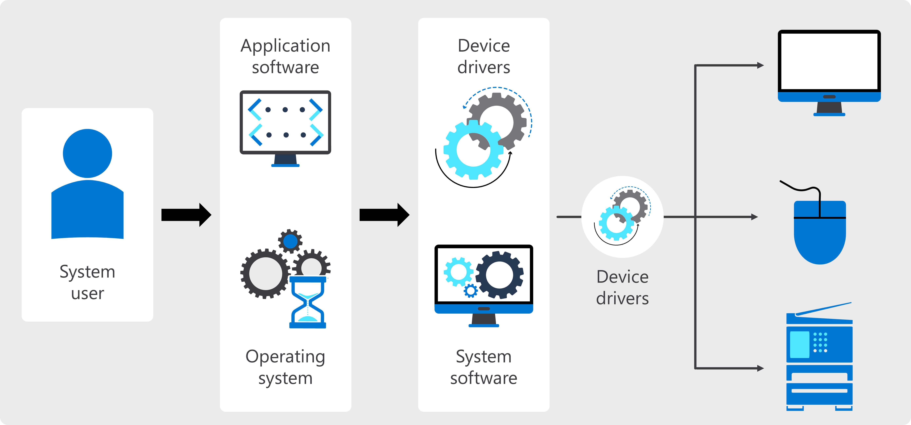

# Hardware versus Software

## Introduction

Hardware makes the physical device operate, and software gives instructions so that the hardware knows what to do and how to do it. This interdependent relationship allows you to interact with your computer. In this reading, you'll be introduced to software aspects that are necessary to run a computer.

## What are Hardware and Software?

Software correlates to any virtual programs that are run on the computer. These include operating systems, programs such as Microsoft Word and Excel, or internet browsers. The hardware installed on your computer determines which of these software applications can run and where it should run.

Broadly speaking, software systems consist of two overarching categories:

- Application software
- System software

Application software is responsible for running specific applications like Microsoft Word or Excel. System Software relates to running the actual hardware itself. An example of this would be device drivers or operating systems like Windows or Mac. An operating system can run on a PC, Mac, phone, or other devices. You'll explore operating systems in more detail at a later stage.

## Hardware

Application and system software make the hardware function as intended. Hardware is typically the long-lasting aspect of a computer. It is possible to update your hardware by adding additional features like more RAM or installing SSDs. There may be a slight improvement, but it mostly retains its original state from when it was first purchased. The way you interact with your computer can be improved by buying better monitors or keyboards. Hardware has a certain life span, and components tend to age and wear down over time.

## Software

Contrary to this, software runs consistently over time but changes constantly with patches and updates for programs that are regularly being released. Generally, these releases relate more to security issues than improving performance. As a program matures and is used widely, various flaws and bugs are detected. Once it's reported, fixes are rolled out. This is why you are regularly prompted to upgrade your system.

Recall that hardware and software are interdependent to work. A computer is just a heap of plastic and silicon without an interface to receive input commands. Note that you are able to automate software to run continually. Some examples include sensor lights or traffic light sequences. If a program is compatible, it can run on various types of hardware.

If a software upgrade is not working well, a workable solution is to upload an older version and restore it to a functional previous state.

## Conclusion

This reading taught you what software is and how it relies on hardware to run. While there is a distinction, ultimately, hardware and software depend on each other. You can't interact with hardware without having some software to interpret and execute your commands. Equally, software needs somewhere to be housed. Computer programs and applications cannot exist without some substance to ground them. You'll gain some more insight when you explore different operating systems.

# Monitors and Graphics Cards: How Visuals Come to Life

## Introduction

Imagine gaming with friends at a nearby cafe. Each gamer intently focuses on their screens, and each player's monitor vividly displays all the game's action, thanks to the high-performance graphics cards installed on their machines. These cards process and render intricate visual data, ensuring an immersive experience for every player. Understanding the synergy between monitors and graphics cards is vital for optimizing gaming setups and staying ahead in the competitive gaming world.

In this reading, you will explore the technology behind monitors and graphics cards, including their functions, features, and advancements.

## Monitors: Displaying Visuals with Precision

Let’s start with monitors, the primary interface through which users interact with the hardware. They are the output devices that present the processed visual data generated by graphics cards. Monitors come in various sizes, resolutions, and technologies, so it is essential to know the task requirements before matching a user with a monitor. The two most common types of monitors are LCD (Liquid Crystal Display) and LED (Light Emitting Diode). LCDs use liquid crystals to control light transmission, while LED displays use arrays of light-emitting diodes to illuminate the screen. All modern LCD monitors are LED-backlit, but the term LED monitor refers explicitly to LED-backlit LCDs with local dimming technology, which can significantly enhance image quality.

Like gamers, an employee working on image editing software will require higher resolution for greater clarity in displayed images. Resolution refers to the number of pixels horizontally and vertically on the screen. Higher resolutions, such as 1920x1080 (Full HD) or 3840x2160 (4K Ultra HD), provide sharper and more detailed visuals. Color depth, on the other hand, refers to the number of colors a monitor can display. Higher color depths, such as 8-bit or 10-bit, allow for a broader range of colors and more accurate color reproduction.

Refresh rate is another essential factor to consider when it comes to monitors. It is expressed in Hertz (Hz) and relates to the frequency at which the screen refreshes. A higher refresh rate, such as 144Hz or 240Hz, results in smoother motion and reduces motion blur, making it ideal for gaming and fast-paced visuals. The refresh rate is critical for LCD and LED monitors but also plays a vital role in LCD technology. LCD screens rely on a backlight to illuminate the pixels, and the refresh rate determines how often the entire screen is redrawn. A higher refresh rate means the backlight refreshes more frequently, reducing motion blur and improving the viewing experience.

The refresh rate is crucial in LED monitors for achieving smooth motion and reducing flicker. However, LED technology offers an advantage over LCD regarding refresh rate capabilities. LED backlights, which are more accurate and efficient, allow for higher refresh rates without using excessive power.

## Graphics Cards: Powering Visual Processing

Now, let’s explore graphics cards (GPUs). GPUs are specialized computer chips designed to handle and accelerate graphics workloads. They perform rapid mathematical calculations to render graphics and images precisely and quickly. GPUs were initially developed for 2D and 3D rendering, animations, and video processing. However, their applications have expanded significantly over time. Parallel processing is a crucial feature of GPUs. They consist of multiple processors that simultaneously handle separate parts of a single task. This similar processing capability allows GPUs to execute graphics-related calculations quickly, enabling fast and smooth rendering of content on the screen. GPUs also have dedicated RAM, specifically designed to store the large amounts of data required for graphics-intensive applications. Advancements in GPUs have made them highly versatile and programmable. They are now used for gaming and creative content production, video editing, high-performance computing (HPC), and artificial intelligence (AI). GPUs have become essential for accelerating real-time 2D and 3D graphics applications, training deep learning neural networks, and enhancing the performance of machine learning algorithms.

One of the critical functions of a graphics card is to transform raw data into pixels, which are the building blocks of images. This process involves three main stages: geometry processing, rasterization, and pixel shading. Geometry processing transforms 3D models into 2D representations, while rasterization converts these representations into a series of pixels. Finally, pixel shading determines the color and appearance of each pixel based on lighting, textures, and other visual effects.

## Integrated vs. Discrete GPUs: Choosing the Right Option

There are two types of GPUs available: integrated and discrete. Integrated GPUs are built into the computer's motherboard or integrated with the CPU. They are generally smaller and lighter, consuming less power and reducing the overall cost of the device. However, integrated GPUs are not easily upgradable, requiring the purchase of a new device if graphics need to change. Discrete GPUs, on the other hand, are independent circuit boards or detachable graphics cards with solid capabilities that offer more processing power and can be upgraded following the user's needs. Discrete GPUs are commonly used in resource-intensive applications such as 3D games, where high-performance graphics rendering is essential. However, they consume more energy and generate more heat, often requiring dedicated cooling systems.

## Cloud GPUs: A Flexible and Scalable Solution

In recent years, cloud GPUs have emerged as an alternative to traditional GPU deployments. Cloud GPUs are provided by cloud service providers; they are virtual GPU services that do away with the need for local GPU hardware and software. They are particularly beneficial for companies requiring heavy computing power or working with machine learning or 3D visualizations. Cloud GPUs offer several advantages, including freeing up local resources, saving time and cost, and providing greater scalability. Users can choose from a range of GPU types based on their specific needs, accessing them on-demand through a web browser. Cloud GPUs are widely used in applications like data analysis, generative AI, financial risk management, gaming, medical imaging, 3D rendering, and HPC.

## Conclusion

As you have discovered, monitors and graphics cards are integral components of computer graphics, working together to deliver stunning visuals. Monitors provide the interface through which users interact with graphics, while graphics cards process and render the visual data. Understanding the technology behind monitors and graphics cards, including resolution, color depth, refresh rates, and parallel processing, helps users appreciate the complex processes that enable the visual displays they see on their screens. Whether gaming, content creation, or AI applications, monitors and graphics cards continue to evolve, pushing the boundaries of visual experiences.
