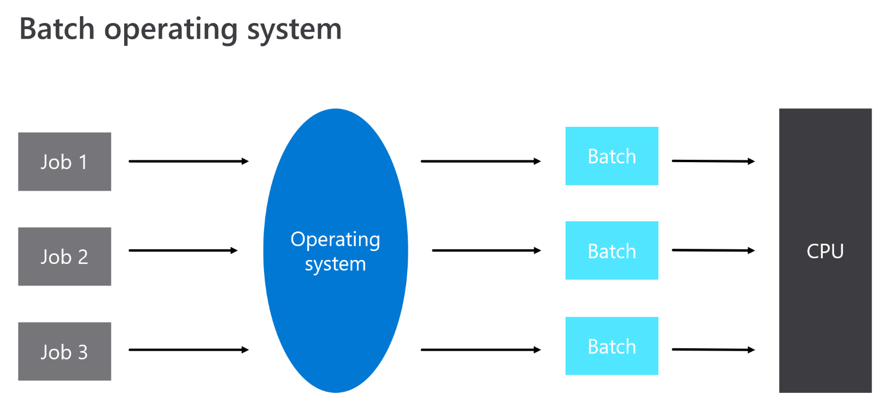
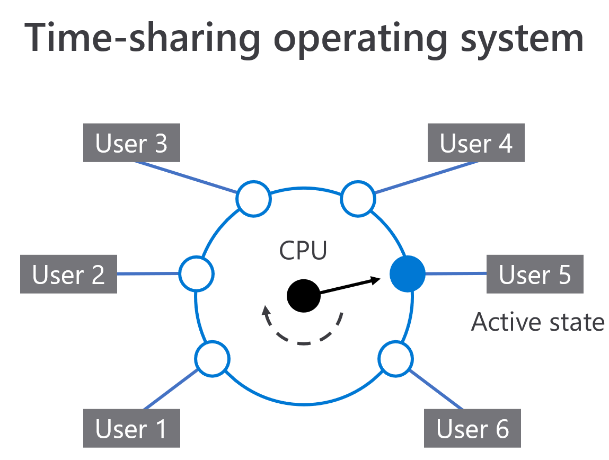
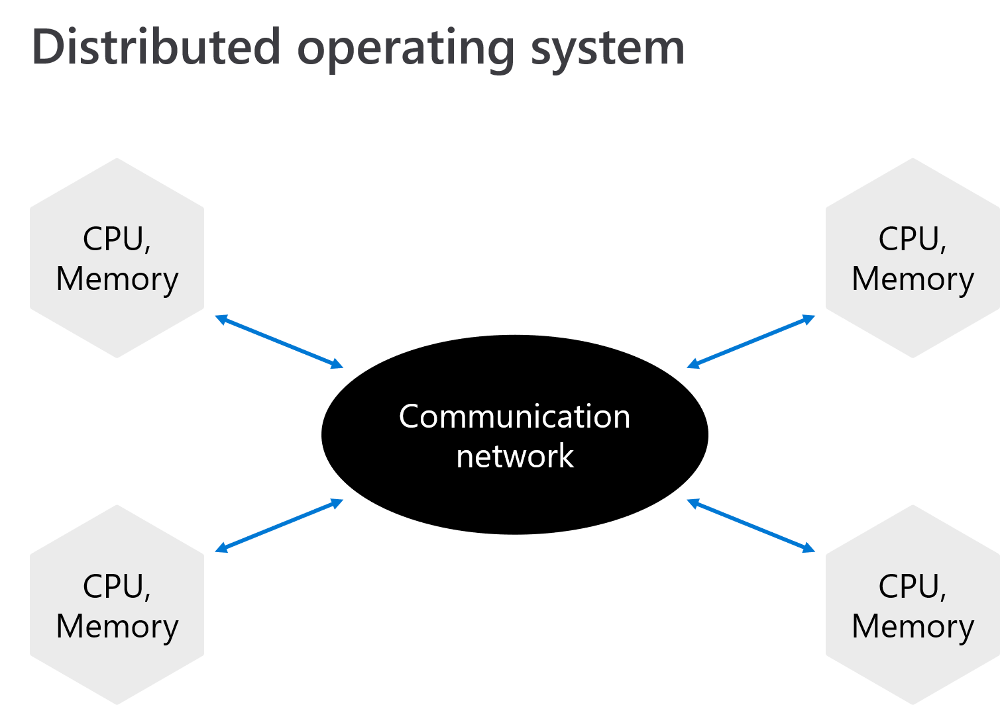
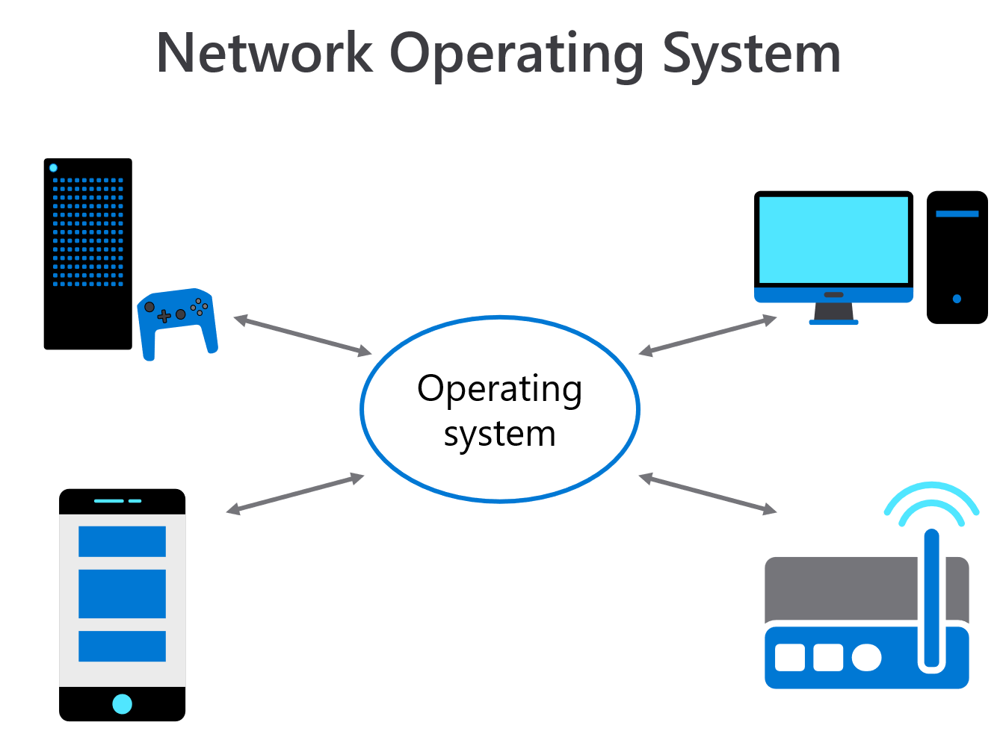
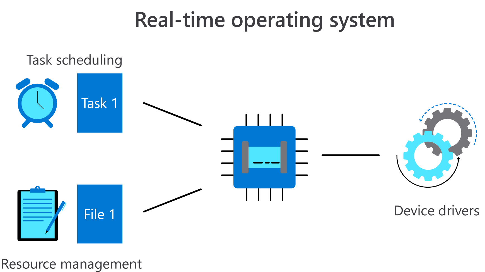

# Types of Operating Systems

## Introduction

Previously, you became familiar with the various hardware and software components that comprise a computer, and the functions they serve. To manage these elements, you would need some software that will oversee the interactions between the software, hardware, and human operator, as well as scheduling the executions of the various tasks required. This is where operating systems enter the picture.

An Operating System (OS) is a term for software that oversees the interaction between hardware and software operations and provides a means through which a human can interact with the system. Systems will have different needs and functionalities, so there are several variations of operating systems that can run the application. By the end of this reading, you’ll be able to describe several different operating systems and identify their advantages and drawbacks.

## Types of Operating Systems

There are numerous operating system types, in this reading, you will learn about the five variations, and what distinguishes them from one another. The categories are:

- Batch Operating Systems
- Time-sharing Operating Systems
- Distributed Operating Systems
- Network Operating Systems
- Real-Time Operating Systems

While the fundamental principles of what each OS does is the same, the way that each achieves this end is different. Let’s examine what distinguishes each approach.

### Batch Operating Systems (BOS)

A BOS allows multiple users to work in tandem by compartmentalizing each user’s actions and only allowing one user control at any given time. Users cannot communicate with one another and when the task is complete, control is passed to the next user. The advantage of this approach is that it allows many users to work on large projects at the same time.

The rationale behind this approach is that large projects are broken into smaller, more manageable chunks and hence do not require being loaded into memory all at once. Another advantage is that similar types of jobs that are queued to run will be run together. This is quicker as it reduces the overhead in loading and queuing the resources that are mutual to each task. The challenge is in coordinating many different users operating at once. This results in some tasks running slower because excessive time is spent waiting for the OS to free up the resources.

### Time-Sharing Operating Systems (TOS)

This approach is also known as a Multitasking System as it enables the execution of many different tasks. A TOS operates in a timed manner: a unit of time called a quantum is allocated to each task. These tasks are queued for the CPU, which will work on each one for a quantum before rotating to the next task.

This approach is beneficial when the task load is running several small tasks. The major advantage of this approach is that it minimizes CPU wait time, and every user is given a fair time location. The disadvantage to this approach is that the rapid switching between tasks can result in some communication issues, with data being mixed up.

### Distributed Operating Systems (DOS)

This approach to processing is a natural progression as internet communication improves. A DOS connects several dispersed CPUs to execute tasks. There is no central source and communication is achieved through using clear protocols on a communication network.

The advantage of using a distributed approach is that it can scale up or down depending on the processing need. As the network is dispersed there is greater robustness to failure. A drawback is that it is still a relatively new approach and so the communication protocols are not well defined.

### Network Operating Systems (NOS)

This type of operating system runs on a network and allows for the sharing of users, groups, securities, and applications. Typically, the network would contain one server-based OS that interacts with the OS of each individual device on the system. It is possible to have any number of devices on the network, and they can be of different types. For example, you could add a printer, digital thermometer, and several computers to one system and have them all interact. This type of approach would be considered tightly-coupled, as the devices utilize a shared network and demonstrate high interactivity with each other.

The advantage of this approach is that users can remotely log on, enabling easy upgrading as new devices and technology can be added to the existing network. It can however be costly to maintain and requires a centralized location for performing operations.

### Real-time Operating Systems (RTOS)

An RTOS is a type of OS for applications that need real-time computations. While many approaches may share resources and operate under a time share, RTOS differs in that it prioritizes tasks by importance. This approach is event-driven with an emphasis on engaging and completing tasks as soon as they arise. This distinguishes RTOS from the other approaches mentioned, in which the priority of a task is determined by the time allocated. These operating systems are generally task-specific approaches and are commonly found in systems such as autonomous cars, air traffic controls, and more.

The advantage of this approach is that it can generate results with exceptional speed by using a priority queue that emphasizes completing a task reactively. The disadvantage is that it is very specialized and does not generalize well to performing a diverse range of tasks.

## Conclusion

In this reading, you’ve analyzed various categories of operating systems, specifically batch operating, time-sharing, distributed, network, and real-time systems. You’re now aware that each one has its advantages and disadvantages, and there is no single best approach. You should know that different operating systems exist for different tasks, and knowing how to distinguish between them will help with decision-making in future cases.

# Proprietary and Open-Source Software

## Introduction

One decision you will face at some stage in your career is determining what type of software you should use to achieve a business need. A business need is a set of company goals, and the actions to take to achieve those goals, and generate money for business success.

Sam sells ice cream, so the business needs are related to purchasing and selling ice cream with additional associated tasks that generate revenue. To achieve efficiency and automation of processes while maintaining a quick turnaround time, Sam must decide which software or hardware components are best suited.

An important consideration is the type of software. In this reading, you’ll discover the distinction between open-source and proprietary software, and whether one is preferred over the other.

## Software Licensing

There are two main types of software licensing, namely, Open-source software (OSS) and Proprietary software (PS). To summarize the key difference, an OSS license includes permissions for content to be freely distributed and modified for appropriate use. In contrast, a PS license must be purchased, and restrictions are placed on how the software is used. Some restrictions might also dictate that the source code cannot be altered or determine how it is sold or further distributed. Next, let’s explore each of these license types in greater detail.

## Characteristics of Open source vs. Proprietary Software

### Modifications

- **Open Source Software (OSS)** empowers users by allowing them to modify source content without consulting the software's original owners. This not only leads to rapid bug fixes and issue resolution but also fosters a community of dedicated hobbyists who voluntarily provide fixes and support for one another.
- **Proprietary Software (PS)**, in comparison, is more restrictive. It ensures that any alterations to the code improve it overall for the users. There is a sense of security and credibility because verified professionals make changes to the code.

### Costing

- A benefit of OSS is that it has no costs. However, errors and bugs may go unaddressed if a software application is not popular. This contrasts with PS, where the issue might be extended wait times until a mistake is addressed.
- PS will produce a polished and professional product, but the attention to detail comes with a price tag.

## Open-source Software advantages

There are several advantages of using open-source software that has a strong community following. These include:

- Positive opportunities for collaboration,
- Robust technical support to help users adapt to the software,
- The ability to address any integration issues faced.
- It also offers flexibility, as one can alter the software or use a variation made to the software that suits your project.
- Lastly, it removes the dangers of vendor lock-in.

The table below provides examples of both open-source and proprietary software.

| Open-source software | Propriety software |
|----------------------|--------------------|
| Linux                | Avast              |
| React                | MacOS              |
| Free office          | Windows            |

## Conclusion

In this reading, you discovered the difference between OSS and PS and explored the characteristics of each type of software. Succinctly, OSS is free and modifiable code with a community of developers who contribute to it. In contrast, PS comes with a purchase price, but if there are issues with the product then the software owners commit to fixing it. It comes with the guarantee that it has been rigorously tested, with clear documentation of how to use it.

# Types of Software: System, Application, and Utility

## Introduction

When you hear the term software, you might immediately associate it with Windows, Linux, or Android. However, software is an encompassing term that covers all the code that runs on hardware and directs how the hardware operates. Additionally, various software categories can share common roles. In this reading, you will dive into the world of software that is found in various computing environments and explore three specific categories:

- **System software**: Manages and controls basic operations of a computer system.
- **Application software**: Programs you interact with to complete your daily tasks.
- **Utility software**: Assists a computer in carrying out regular tasks.

Software plays a crucial role in computer systems' functionality, and understanding the various types is essential for a comprehensive understanding of how these systems operate.

## System Software

System software refers to the programs that manage and control a computer system's basic operations. It includes the operating system and core software, enabling communication between hardware and software components. The operating system provides a platform for other software to run on and manages resources such as memory, CPU, and storage.

### Device Drivers

Another critical component of system software is the device drivers. Device drivers are software programs that facilitate communication between the operating system and hardware devices such as printers, scanners, and graphics cards. They act as intermediaries, translating commands from the operating system into a language that the hardware can understand.

## Application Software

Application software is designed to perform specific tasks or provide specific functionality to users. It can be categorized into different domains: productivity, entertainment, communication, and more. Examples include word processors, spreadsheets, web browsers, media players, and video editing software. Each application software serves a specific purpose and is tailored to meet the requirements of its intended users.

## Utility Software

Utility software assists in managing and maintaining computer systems. These tools optimize system performance, enhance security, and provide additional functionality. Examples include antivirus programs, disk defragmenters, file compression tools, and backup software. Antivirus programs protect computer systems from malware, while disk defragmenters optimize the arrangement of files on a hard drive.

## Conclusion

In this reading, you learned the difference between the various software types. Specifically, you discovered that system software runs the hardware, application software caters to your specific needs, and utility software assists in system management and optimization. By categorizing software into system, application, and utility software, you can better understand the diverse software landscape and how different types of software serve various purposes. This knowledge is essential for anyone seeking to explore computer systems and understand their functionality comprehensively.
